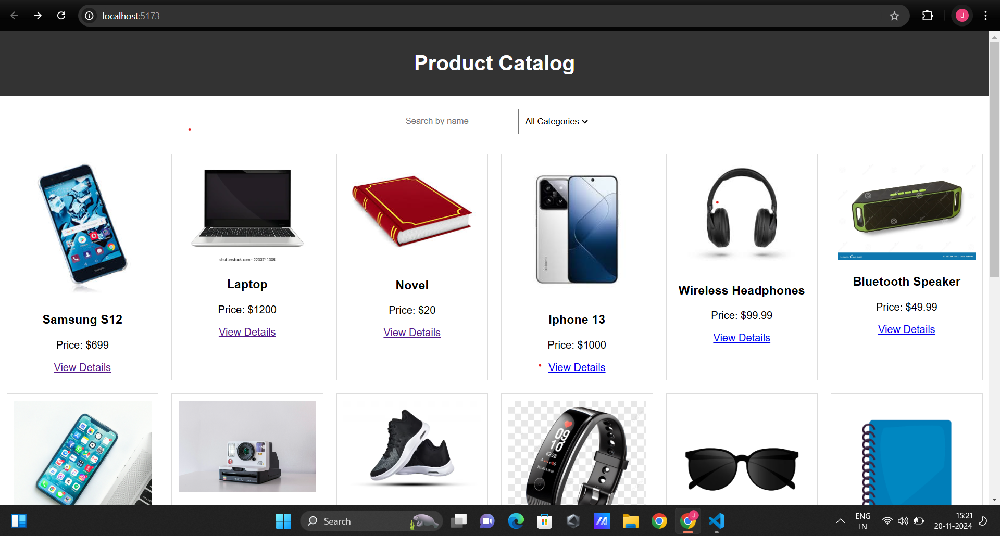
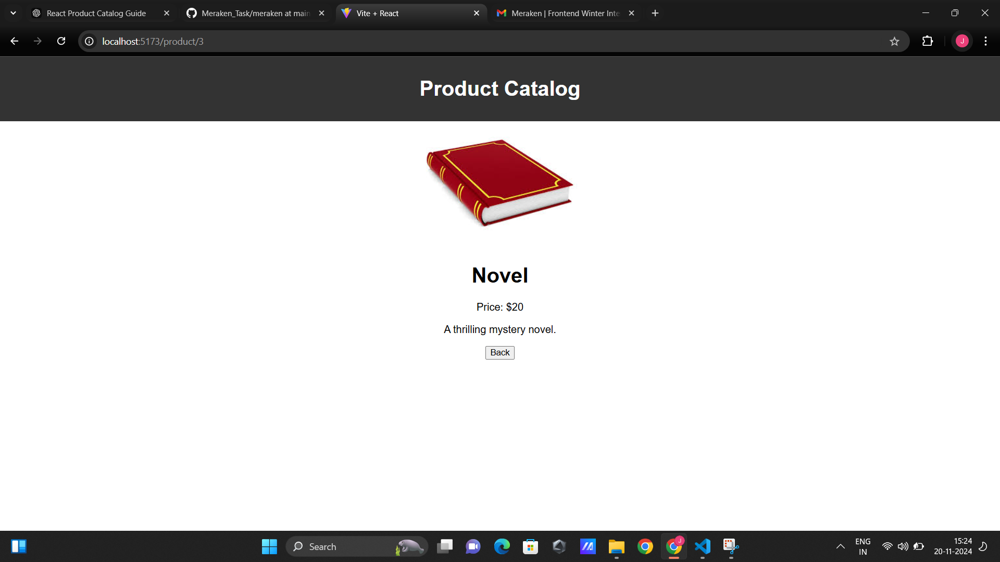
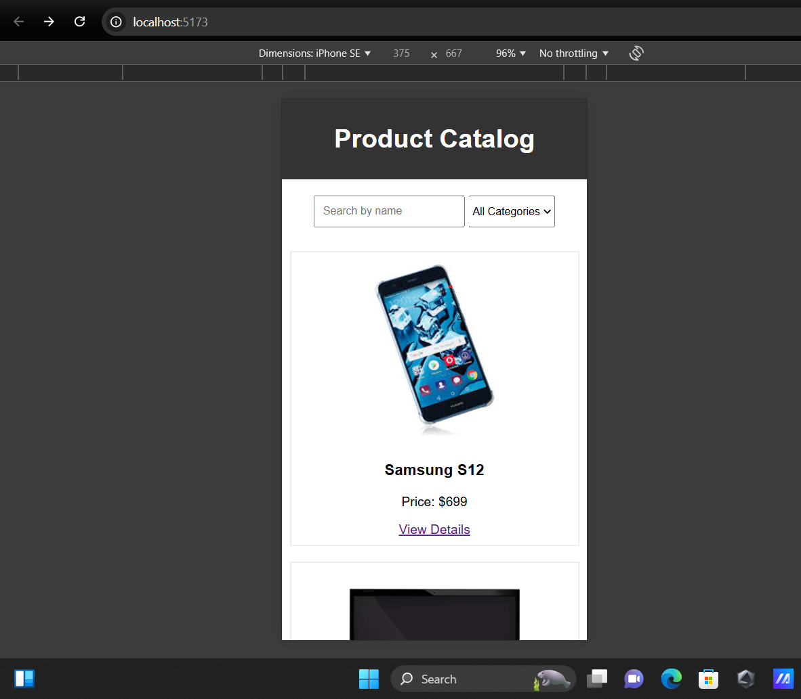

# React Product Catalog

A single-page product catalog built with React.js, featuring product listing, filtering, searching, and detailed views. This project uses static JSON data to display a list of 15 products.

---

## Features

### 🎨 Product Listing
- Displays a grid layout of products with an image, name, price, and a "View Details" button.

### 🔍 Product Details
- View detailed information about a selected product, including its description and larger image.
- Navigate back to the main product listing using **React Router**.

### 🔎 Search Functionality
- Real-time search for products by name.
- Dynamically filters product results as you type.

### 📂 Category Filtering
- Filter products based on categories.
- Supports filtering by multiple categories simultaneously.

### 📱 Responsive Design
- Optimized for various screen sizes, including desktops, tablets, and mobile devices.

### 🛠️ Reusable Components
- Modular and reusable React components for improved scalability and maintainability.

---

## Installation Instructions

Follow these steps to run the project locally:

### 1. Clone the Repository
```bash
git clone https://github.com/your-username/react-product-catalog.git
cd react-product-catalog
```
### 2. Install Dependencies
```bash
npm install
```
### 3. Start the Application
```bash
npm start
```

## Libraries and Tools Used
- **React.js**: Core framework for building the UI.
- **React Router DOM**: For routing between pages (e.g., product list and details).
- **CSS**: For styling and responsive design.

## Challenges Faced
### 1. Dynamic Search and Filtering
- **Issue**: Combining search and category filters dynamically.
- **Solution**: Used React state (useState) to update the product list in real-time by chaining filter() methods.

### 2. Responsive Design
- **Issue**: Ensuring the layout works on all screen sizes.
- **Solution**: Used CSS Grid and media queries for flexibility.

## Screenshots
### 1. **Product Listing Page**
- 

### 2.**Product Details Page**
- 

### 3. **Responsive Mobile View**
- 